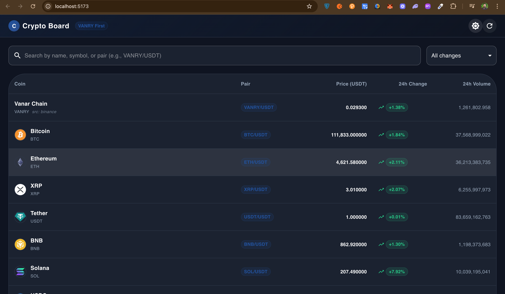
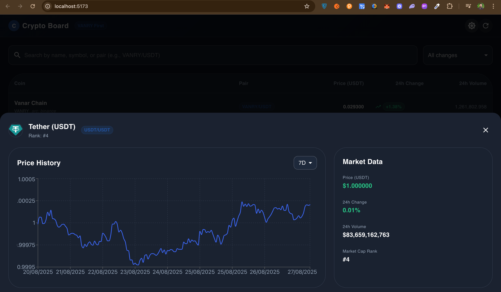

# 🪙 Crypto Price SPA with Vanry/USDT (React + MUI)

A responsive **single-page application (SPA)** that displays live cryptocurrency prices using the **CoinGecko API** (with Binance fallback for Vanry/USDT).
The app is built with **React**, **Material UI (MUI)**, and **Recharts**.

---

## ✨ Features

- ✅ **Vanry/USDT pair shown first** (using Binance data, fallback to CoinGecko).
- ✅ Homepage with **coin list**, **price**, **24h % change**, and **volume**.
- ✅ **Search & filter** coins (by name, symbol, or pair).
- ✅ Click a coin to view **detail modal** with:
  - Interactive **price chart** (1D, 7D, 30D, 90D).
  - Key stats: price, 24h change, volume.
- ✅ **Dark/Light mode toggle**.
- ✅ Fully responsive, professional **MUI design**.

---

## 🚀 Tech Stack

- [React](https://react.dev/)
- [Material UI (MUI)](https://mui.com/)
- [Recharts](https://recharts.org/)
- [CoinGecko API](https://www.coingecko.com/en/api)
- [Binance API](https://binance-docs.github.io/apidocs/spot/en/#symbol-price-ticker)

---

## 📦 Installation & Setup

Clone this repo and install dependencies:

```bash
git clone https://github.com/Muhammad-Shahzaib-Saleem/crypto_price_borad.git
cd crypto-price-insights
npm install
```

Run development server:

```bash
npm run dev
```

Open in browser:

http://localhost:5173

Build for production:

```bash
npm run build
```

---

## ⚙️ Configuration

- The app fetches crypto market data from **CoinGecko**.
- For **Vanry/USDT**, it first tries **Binance API**, then falls back to **CoinGecko USD pair**.

---

## 📸 Screenshots

### Homepage (List of Coins)



### Coin Detail with Chart



## 🙌 Contributing

Pull requests are welcome! For major changes, open an issue first to discuss what you’d like to improve.

---

## 📄 License

This project is **MIT licensed**.
